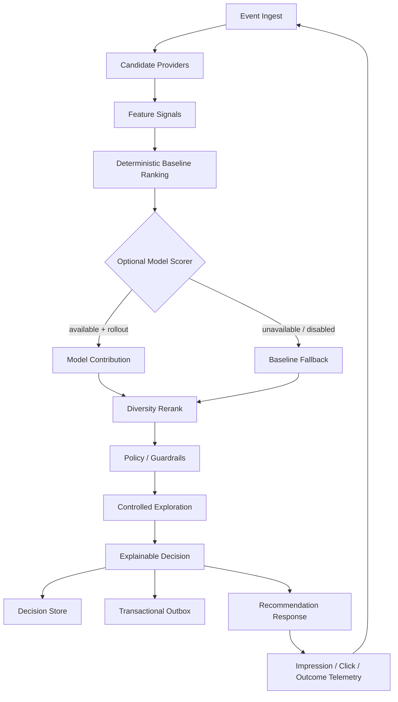

# GMF Core

**Open-source recommendation, ranking, telemetry, and decisioning infrastructure for marketplaces.**

[](https://github.com/Muhail01/GMF-Core/releases)
[](https://github.com/Muhail01/GMF-Core/actions/workflows/ci.yml)
[](LICENSE)
[](go.mod)

GMF Core is a vendor-neutral engine for **recommendation systems, organic ranking, personalization, experimentation, decision tracing, and telemetry attribution**. It is designed for digital marketplaces, ecommerce, discovery products, content feeds, and other systems that need explainable online decisions without coupling the core runtime to proprietary business logic.

```text
Event Ingest
    ↓
Candidate Providers
    ↓
Feature Signals
    ↓
Deterministic Baseline Ranking
    ↓
Optional Model Scoring
    ↓
Diversity Rerank
    ↓
Policy / Guardrails
    ↓
Controlled Exploration
    ↓
Explainable Decision
    ↓
Decision Log + Transactional Outbox
    ↓
Impression / Click / Outcome Telemetry
```

> **Current release:** `v0.1.0` — standalone Go API, PostgreSQL and in-memory storage, transactional outbox worker, TypeScript telemetry SDK, OpenAPI 3.1, Docker Compose, explainable decisions, model fallback, property/fuzz coverage, and green CI.

## Quick start — under 2 minutes

Clone and start the full PostgreSQL-backed reference stack:

```bash
git clone https://github.com/Muhail01/GMF-Core.git
cd GMF-Core
docker compose up --build
```

Check health:

```bash
curl -s http://localhost:8080/healthz
```

Request recommendations:

```bash
curl -s -X POST http://localhost:8080/v1/recommendations \
  -H 'Content-Type: application/json' \
  -d '{
    "surface":"home",
    "session_id":"demo-session",
    "limit":4,
    "context":{"category":"games"}
  }'
```

The response contains a stable `decision_id`, ranked items, scores, reason codes, and score breakdowns:

```json
{
  "decision_id": "decision-...",
  "surface": "home",
  "items": [
    {
      "item_id": "game-1",
      "rank": 1,
      "score": 0.86,
      "reason_code": "ranked",
      "breakdown": {
        "relevance": 0.52,
        "quality": 0.26,
        "freshness": 0.08
      }
    }
  ],
  "fallback": false,
  "reason_codes": [],
  "created_at": "..."
}
```

Retrieve the persisted decision for debugging and explainability:

```bash
curl -s http://localhost:8080/v1/decisions/<decision-id>
```

Link telemetry back to the exact decision that produced the recommendation:

```bash
curl -s -X POST http://localhost:8080/v1/events \
  -H 'Content-Type: application/json' \
  -d '{
    "event_id":"evt-1",
    "event_type":"recommendation_impression",
    "session_id":"demo-session",
    "decision_id":"<decision-id>",
    "item_id":"game-1",
    "surface":"home"
  }'
```

That gives you the core feedback loop:

```text
POST /v1/recommendations
→ decision_id
→ ranked items + score breakdown
→ GET /v1/decisions/{decision_id}
→ recommendation_impression / recommendation_click
→ attribution back to the original decision
```

## Why GMF Core exists

Recommendation infrastructure often becomes inseparable from one product, one database schema, and private commercial rules. GMF Core separates reusable online-decision primitives from those proprietary concerns.

The goal is not to prescribe one machine-learning stack. The default path remains deterministic and explainable, while external model scoring is optional and protected by deterministic rollout plus fail-safe baseline fallback.

GMF Core is useful when you need to answer questions such as:

- Which products or content should this user/session see now?
- How do we combine deterministic ranking with an optional model safely?
- How do we enforce diversity, concentration limits, eligibility, and policy guardrails?
- How do we experiment without losing deterministic fallback behavior?
- How do we trace an impression or click back to the exact ranking decision?
- How do we publish decision and telemetry events transactionally?
- How do we keep observability useful without putting user IDs or other high-cardinality/private values into metric labels?

## What is included

| Area | Current capability |
| --- | --- |
| Decision API | `POST /v1/recommendations` |
| Event API | `POST /v1/events` with idempotent event IDs |
| Explainability | Stable `decision_id`, reason codes, score breakdowns |
| Decision lookup | `GET /v1/decisions/{decision_id}` |
| Candidate generation | Pluggable `CandidateProvider` interface |
| Ranking | Deterministic weighted scoring with stable tie-breaking |
| Model assist | Optional scorer with deterministic rollout and safe baseline fallback |
| Reranking | Diversity/concentration control |
| Policy | Guardrails and safe fallback behavior |
| Exploration | Bounded deterministic exploration |
| Registries | Feature, model, experiment, and exploration primitives |
| Storage | In-memory and PostgreSQL adapters |
| Delivery | Transactional outbox + provider-neutral reference worker |
| Telemetry | Impression/click attribution through decision IDs |
| SDK | TypeScript telemetry SDK |
| Observability | Privacy-safe provider-neutral metric hooks |
| API contract | OpenAPI 3.1 |
| Local deployment | Docker Compose with API + PostgreSQL + worker |
| Quality | Unit/integration/property/fuzz coverage, benchmarks, CI, public-boundary scan |

## Architecture



The PostgreSQL adapter writes decisions/events and their outbox records transactionally. `cmd/gmf-worker` is a reference delivery loop; deployments can replace its sink with Kafka, NATS, webhooks, queues, or another transport.

Observability deliberately exposes only low-cardinality runtime dimensions such as `surface`, `event_type`, fallback state, and exploration state. User IDs, session IDs, item IDs, raw queries, messages, tokens, and other private/high-cardinality values are excluded from the public metric contract.

Read more:

- [`docs/ARCHITECTURE.md`](docs/ARCHITECTURE.md)
- [`docs/OPEN_SOURCE_BOUNDARY.md`](docs/OPEN_SOURCE_BOUNDARY.md)
- [`docs/ROADMAP.md`](docs/ROADMAP.md)
- [`openapi.yaml`](openapi.yaml)

## Designed to stay vendor-neutral

The public core intentionally excludes:

- production user and marketplace data;
- payment and wallet logic;
- paid-ad billing and money movement;
- fraud, KYC, dispute, and support systems;
- private seller-risk formulas;
- production ranking coefficients;
- private model artifacts and production model configuration;
- credentials, private endpoints, and deployment topology;
- GILLZY-specific domain integrations.

Integrate your own business logic through candidate providers, feature signals, scorers, policy implementations, storage adapters, observability adapters, and outbox sinks.

## Good first contributions

GMF Core is intentionally structured so useful integrations can be contributed without understanding a private marketplace codebase.

Great starter areas include:

- Go client SDK;
- Python telemetry/client SDK;
- Redis cache adapter;
- React telemetry hook;
- Kafka or NATS outbox sink examples;
- Prometheus and OpenTelemetry examples;
- ClickHouse telemetry adapter;
- additional benchmarks and deployment examples.

Browse [`good first issue`](https://github.com/Muhail01/GMF-Core/issues?q=is%3Aissue+is%3Aopen+label%3A%22good+first+issue%22) and [`help wanted`](https://github.com/Muhail01/GMF-Core/issues?q=is%3Aissue+is%3Aopen+label%3A%22help+wanted%22) tasks.

Please read [`CONTRIBUTING.md`](CONTRIBUTING.md) before opening a pull request. Security-sensitive reports should follow [`SECURITY.md`](SECURITY.md).

## Roadmap ideas

The core v0.1.0 foundation is intentionally small. High-value next steps include:

- Redis and ClickHouse adapters;
- Kafka and NATS delivery sinks;
- first-class Prometheus/OpenTelemetry adapters;
- Go and Python SDKs;
- React integration helpers;
- richer offline evaluation and replay tooling;
- feature-store provider interfaces;
- additional experiment and exploration controls;
- reproducible latency/throughput benchmark reports.

See [`docs/ROADMAP.md`](docs/ROADMAP.md) and the open issues for contribution-sized tasks.

## Origin

GMF Core is the standalone public extraction of reusable recommendation and decisioning infrastructure originally developed while building **GILLZY**, a digital goods marketplace. The open-source project is independently deployable and intentionally excludes private marketplace data, commercial weights, fraud/risk formulas, payments, advertising/billing, KYC, internal integrations, and production configuration.

## Search keywords

`recommendation engine` · `recommender system` · `recommendation system` · `marketplace recommendations` · `ecommerce personalization` · `organic ranking` · `ranking engine` · `decision engine` · `decisioning` · `personalization` · `candidate generation` · `reranking` · `re-ranking` · `feature scoring` · `model scoring` · `experimentation` · `exploration` · `guardrails` · `telemetry` · `event ingestion` · `decision trace` · `explainable recommendations` · `transactional outbox` · `PostgreSQL` · `Go` · `Golang` · `TypeScript SDK` · `OpenAPI` · `Docker Compose` · `OpenTelemetry` · `Prometheus` · `Kafka` · `NATS` · `ClickHouse`

## Release

Latest release: [`v0.1.0`](https://github.com/Muhail01/GMF-Core/releases/tag/v0.1.0).

## License

Apache-2.0. See [`LICENSE`](LICENSE).
